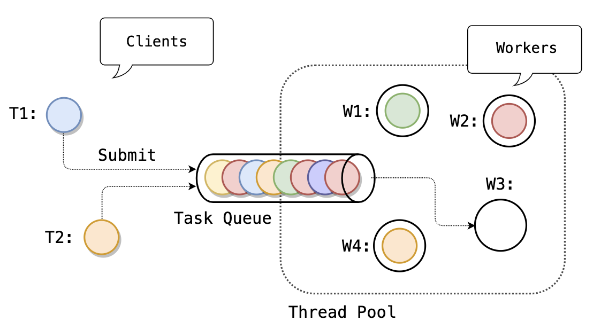

# Thread Pool

## Пререквизиты

- [sync/mutex](/tasks/sync/mutex)
- [sync/condvar](/tasks/sync/condvar)
- [sync/wait_group](/tasks/sync/wait_group)

----


В этой задаче мы напишем базовый инфраструктурный компонент для параллельного исполнения задач – _пул потоков_ (_thread pool_).

Далее с потоками и параллельностью мы будем работать **исключительно** через пулы.

## Схема работы



## Static

Пул потоков будет _статическим_ – число потоков фиксируется при создании пула и не меняется до его остановки.

```cpp
ThreadPool pool{/*threads=*/4};
```

Обратите внимание на функцию [`std::hardware_concurrency`](https://en.cppreference.com/w/cpp/thread/thread/hardware_concurrency).

## `Start`

Пул должен быть запущен с помощью явного вызова метода `Start`:

```cpp
ThreadPool pool{4};

// Стартуем 4 потока-воркера
pool.Start();
```

## `Submit`

Пул потоков исполняет _задачи_ (_tasks_) – функции без аргументов и возвращаемого значения.

Задача планируется на исполнение с помощью метода `Submit`:

```cpp
ThreadPool pool{4};
pool.Start(); 

// Пул стартовал, можно планировать в него задачи

pool.Submit([] {
  fmt::println("Running on thread pool");
});
```

Вызов `Submit` не дожидается завершения задачи, он лишь добавляет ее в очередь задач пула потоков, после чего возвращает управление.

Метод `Submit` можно вызывать из разных потоков, он не требует внешней синхронизации.

Метод `Submit` можно вызывать только после (в смысле причинности) `Start`, в противном случае поведение не определено.

## `Current`

Исполняемая задача может получить указатель на текущий пул с помощью статического метода `Current`.

Если метод `Current` вызван не из бегущей задачи (т.е. не из потока пула), а из внешнего потока, то вызов вернет `nullptr`.

### Пример
```cpp
ThreadPool pool{4};

pool.Start();

pool.Submit([] {
  // Планируем задачу из задачи
  ThreadPool::Current()->Submit([] {
    fmt::println("Continue");
  });
});
```

## Ожидание

Наш пул потоков не будет уметь дожидаться завершения задач, его единственная ответственность – исполнение задач. 

Для ожидания задач пользователь будет использовать внешние инструменты:

### `WaitGroup`

Для ожидания группы задач будем использовать `WaitGroup`:

```cpp
ThreadPool pool{4};
pool.Start();

WaitGroup wg;
for (size_t i = 0; i < 128; ++i) {
  wg.Add(1);
  pool.Submit([&wg] {
    wg.Done();
  });
}

wg.Wait();

pool.Stop();
```

### `Future`

Для ожидания конкретной задачи и для передачи результата вычисления из задачи
будем использовать `Future`:

```cpp
ThreadPool pool{4};
pool.Start();

// Контракт
Promise<int> p;
auto f = p.GetFuture();

pool.Submit([p = std::move(p)]() mutable {
  std::move(p).SetValue(42);  // Исполняем контракт
});

int v = f.Get();  // Блокируем поток до исполнения контракта
fmt::println("v = {}", v);

pool.Stop();
```

См. отдельную задачу [future/std](/tasks/future/std)

## Исключения

Пул не знает о природе запланированных в него задач,
так что единственной разумной реакцией потока-воркера на исключение, не обработанное задачей пользователя, будет аварийное завершение программы.


## `Stop`

Пул должен быть остановлен до своего разрушения явно с помощью метода `Stop`.

Вызов `Stop` возвращает управление, когда все потоки пула остановлены.

Вызвать метод `Stop` можно только один раз.

Вызов `Stop` подразумевает, что в пуле не осталось задач и что новые задачи в него планироваться больше не будут.

## Управление пулом

Можно считать, что методы `Start` и `Stop` вызываются только одним потоком, т.е. только последовательно.

## Очередь задач

Для распределения задач между потоками пула будем использовать `UnboundedBlockingQueue` – блокирующую очередь неограниченной емкости.

### API

| Метод | Семантика |
|---|---|
| `void Push(T)` | Добавить элемент в хвост очереди. Если очередь закрыта вызовом `Close`, то поведение не определено |
| `std::optional<T> Pop()` | Дождаться и извлечь элемент из головы очереди; если же очередь закрыта и пуста, то вернуть `std::nullopt`. |
| `void Close()` | Закрыть очередь для новых `Push`. Уже добавленные в очередь элементы останутся доступными для извлечения. |

### Пример

```cpp
UnboundedBlockingQueue<int> queue;

// Producer
std::thread producer([&] {
  for (int i = 0; i < 16; ++i) {
    queue.Push(i);
  }
  queue.Close();
});

// Consumer
while (auto v = queue.Pop()) {
  fmt::println("{}", *v);
}

producer.join();
```

## Задание

0) Перенесите реализацию [`WaitGroup`](exe/wait_group.hpp) из задачи [sync/wait_group](/tasks/sync/wait_group)
1) Реализуйте блокирующую очередь – [`UnboundedBlockingQueue`](exe/queue.hpp)
2) Реализуйте пул потоков – [`ThreadPool`](exe/thread_pool.hpp)

## Замечания по реализации

### Библиотека `exe`

Вы можете добавлять в `exe/` новые файлы.

### API

Добавлять новые публичные методы к пулу потоков нельзя, его API является завершенным.

### Деструктор

Напишите `assert` в деструктор на случай забытого вызова `Stop`.

### `thread_local`

Задача тестируется в режиме симуляции, так что нам потребуется аннотировать `thread_local` указатель на текущий пул:

- [Документация](https://gitlab.com/Lipovsky/twist/-/blob/master/docs/ru/twist/ed/static.md)
- [Пример](https://gitlab.com/Lipovsky/twist/-/blob/master/examples/thread_local/main.cpp)

### Синхронизация

(Опционально)

Перенесите в `exe/` и используйте собственные реализации мьютекса и кондвара из задач [sync/mutex](/tasks/sync/mutex) и [sync/condvar](/tasks/sync/condvar).
